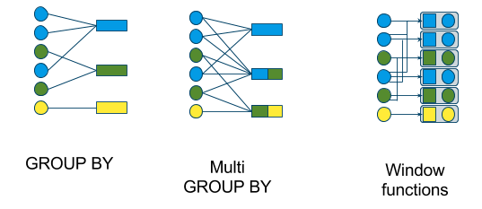
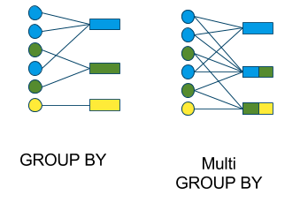

# Completing aggregated calculations using Spark

Generally, we will want to perform calculations by some grouping within our data.  For example, we may want to know the number of employees in each business unit or the amount of sales by month. 

Sometimes, we want a new table based on the grouping variable.  Other times, we will want to keep our observational unit of the original table but add additional columns with the summary variable appended. In SQL, we will differentiate the two calculations by the `GROUP BY` method and the `WINDOW` method.



## GROUP BY

When using 'GROUP BY' functions or methods in the varied languages of data science the observational unit (row) of the resulting table is defined by the levels of the variable used in the 'GROUP BY' argument. We move from many rows to fewer rows.  



### Language specific help files

- [SQL: GROUP BY](https://www.w3schools.com/sql/sql_groupby.asp)
- [dplyr: group_by()](https://dplyr.tidyverse.org/reference/group_by.html)
- [Pandas: df.groupby()](https://pandas.pydata.org/pandas-docs/stable/reference/api/pandas.DataFrame.groupby.html)
- [Pyspark: df.groupBy()](https://spark.apache.org/docs/latest/api/python/reference/api/pyspark.sql.DataFrame.groupBy.html)

The `GROUP BY` methods of each language must be combined with their respective calculation process.

- [SQL: calcluated fields](https://joequery.me/notes/sql-calculated-fields/)
- [dplyr: summarize()](https://dplyr.tidyverse.org/reference/mutate.html) and read their [window example](https://dplyr.tidyverse.org/articles/window-functions.html)
- [Pandas: .agg()](https://pandas.pydata.org/pandas-docs/stable/reference/api/pandas.DataFrame.agg.html)
- [Pyspark: .agg()](https://spark.apache.org/docs/latest/api/python/reference/api/pyspark.sql.GroupedData.agg.html)


### Examples

Here are example calculations using Pyspark and SQL.

We have our default `DataFrame`

```python
import pandas as pd
# create pandas dataframe
pdf = pd.DataFrame({'Section':[1,2,2,3,3,3], 'Student':['a','b','c', 'd', 'e','f'], 'Score':[90, 85, 75, 95, 65, 98]})
# convert to spark dataframe assumping your spark instance is created.
df = spark.createDataFrame(pdf)
```

|   Section | Student   |   Score |
|----------:|:----------|--------:|
|         1 | a         |      90 |
|         2 | b         |      85 |
|         2 | c         |      75 |
|         3 | d         |      95 |
|         3 | e         |      65 |
|         3 | f         |      98 |

The following two examples result in an average and standard deviation for each section.

|   Section |   average |        sd |
|----------:|----------:|----------:|
|         1 |        90 | nan       |
|         2 |        80 |   7.07107 |
|         3 |        86 |  18.2483  |

#### Pyspark

```python
df.groupBy('Section').agg(
  F.mean('Score').alias("average"),
  F.stddev_samp('Score').alias("sd")
)
```

#### SQL

```sql

```


## Window

> At its core, a window function calculates a return value for every input row of a table based on a group of rows, called the Frame. Every input row can have a unique frame associated with it. This characteristic of window functions makes them more powerful than other functions and allows users to express various data processing tasks that are hard (if not impossible) to be expressed without window functions in a concise way. Now, let’s take a look at two examples. [ref](https://databricks.com/blog/2015/07/15/introducing-window-functions-in-spark-sql.html)

### Language specific help files

- [SQL: OVER(PARTITION BY <column>)](https://spark.apache.org/docs/latest/sql-ref-syntax-qry-select-window.html) or [this reference](https://mode.com/sql-tutorial/sql-window-functions/)
- [dplyr: mutate()](https://dplyr.tidyverse.org/articles/window-functions.html)
- [Pandas: transform()](https://pandas.pydata.org/docs/reference/api/pandas.DataFrame.transform.html)
- [Pyspark: .over() with pyspark.sql.Window()](https://spark.apache.org/docs/3.1.1/api/python/reference/api/pyspark.sql.Column.over.html) and [this Databricks guide](https://databricks.com/blog/2015/07/15/introducing-window-functions-in-spark-sql.html)

### Examples

Here are example calculations using Pyspark and SQL. Using the example table above, we want to create the following table.

And we want the following table.

|   Section | Student   |   Score |   rank |   min |
|----------:|:----------|--------:|-------:|------:|
|         1 | a         |      90 |      1 |    90 |
|         2 | b         |      85 |      1 |    75 |
|         2 | c         |      75 |      2 |    75 |
|         3 | d         |      95 |      2 |    65 |
|         3 | e         |      65 |      3 |    65 |
|         3 | f         |      98 |      1 |    65 |

#### Pyspark

```python
from pyspark.sql import Window
import pyspark.sql.functions as F

window_order = Window.partitionBy('Section').orderBy(F.col('Score').desc())
window = Window.partitionBy('Section')

df.withColumn("rank", F.rank().over(window_order)) \
  .withColumn("min", F.min('Score').over(window)) \
  .sort('Student') \
  .show()
```

#### SQL

Using the above `df` we can create a temporary view

```python
df.createOrReplaceTempView("df")
```

Then we can use the following SQL command.

``sql
SELECT Section, Student, Score, 
  RANK(Score) OVER (PARTITION BY Section ORDER BY Score) as rank,
  MIN(Score) OVER (PARTITION BY SECTION) as min
FROM df
```

## References

- https://stackoverflow.com/questions/53647644/how-orderby-affects-window-partitionby-in-pyspark-dataframe
- https://sparkbyexamples.com/pyspark/pyspark-window-functions/#:~:text=PySpark%20Window%20functions%20are%20used,SQL%20and%20PySpark%20DataFrame%20API.
- https://databricks.com/blog/2015/07/15/introducing-window-functions-in-spark-sql.html
- https://knockdata.github.io/spark-window-function-pyspark/
- https://stackoverflow.com/questions/40923165/python-pandas-equivalent-to-r-groupby-mutate
- https://sparkbyexamples.com/spark/spark-sql-window-functions/
